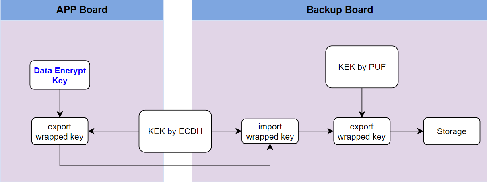

# Encryption Key Backup
The Encryption Key Backup utility is an important element in KMS Controller. 
That includes key generation, key backup, key recovery and data encryption.
In addition, the encryption key is wrapped by the client's PUFse before being 
sent to the server through the TLS tunnel. Encryption key that is only unwrapped 
by the server's PUFse.

## Source
### Directory structure
- [`key_backup`](key_backup): Master folder for key backup functions.
- [`key_backup/app`](key_backup/app): The source files of the key backup.
- [`key_backup/app/ca_key`](key_backup/app/ca_key): Demo certificate.
- [`key_backup/cmake`](key_backup/cmake): Build system configuration files.
- [`key_backup/screenshot`](key_backup/screenshot): key backup screenshot files.
- [`lib`](lib): Master folder for libraries.
- [`lib/libudev`](lib/libudev): libudev folder.
- [`lib/openssl`](lib/openssl): openssl folder. The version is 1.1.1k.
- [`lib/pufse-host-lib`](lib/pufse-host-lib): pufse-host-lib folder.


## Overview of Build Flow

### Required Configurations
- Cross-compiler version is 
arm-linux-gnueabihf-gcc (Ubuntu 9.4.0-1ubuntu1~20.04.1) 9.4.0


- Download the OpenSSL source code from the official website and compile it. This may take several minutes. </p>
Here is the shell script command to accomplish this task.
```bash
./build.sh openssl_arm
```
### Build KeyBackup
- Execute the script to build KeyBackup.
```bash
./build.sh keybackup_arm
```

### Deploy to FPGA board
- Edit the script file "scp_auto.expect" to upload the library and executable files to the target board. Modify the scp server and password in the file.</p>
For example,
```bash
cd key_backup/build
vim scp_auto.expect
```
- Edit the script content to suit your environment and upload the files to the target board via scp
```bash
set scp_server2 "root@172.16.1.94:/home/root/tailu"
spawn scp -P 22105 {*}$src_file $scp_server2
expect "*?assword:" { send "root\r" }
```
- Execute the script to deploy.
```bash
./scp_auto.expect
```

## Utilities

### Topology Overview


- Set the library path and execute the script as follows: </p>
Edit script content
```bash
vim export_lib.sh
```
Run script
```bash
. ./export_lib.sh
```

- Decompress openssl library version 1.1.1k
```bash
tar zxvf openssl_arm.tar.gz
```


###	Application Of Encryption Key


- The Data Encrypt Key is derived from HKDF. The two input parameters of HKDF PUF key and salt are automatically generated by the tool.
- The Generate Key is a command line tool and the execution command is as follows:
```bash
./generateKey
```


- Check whether the Data Encrypt Key in KA is valid by calculating the HMAC of the key.
- The HMAC Key is a command line tool and the execution command is as follows:
```bash
./hmacKey
```


- Clear the Encrypt Key in the PUF KA slot. Once the key is cleared, data encryption or decryption functions will no longer function.
- The Clear Key is a command line tool and the execution command is as follows:
```bash
./clearKey
```


- Data encryption or decryption functions
```bash
encryptData [-d] [-i input_file] [-o output_file]
input_file: Input file for encryption or decryption
output_file: Output file for encryption or decryption
-d: Decryption options
```

- The Encrypt Data is a command line tool and the execution command is as follows:
```bash
./encryptData -i data.txt -o data.enc
```


---
### Backup Encryption Key




- Before using the backup function, a certificate needs to be created for the TLS connection and the TLS connection server must be executed on Backup Board.

- Run script gen_crt.sh to create a certificate. The execution command is as follows:
```bash
./gen_crt.sh
Generating RSA private key, 2048 bit long modulus (2 primes)
..........................+++++
............................................+++++
e is 65537 (0x010001)
Signature ok
subject=C = TW, ST = Taiwan, L = Taipei, O = Example Inc., CN = example.com
Getting Private key
```


- Invoke TLS connection to server on Backup Board. 
```bash
./server [-p SERVER_PORT] [-d key_file_path] [-m]
          -m: mutual TLS
```
- The execution command is as follows:
```bash
./server -p 4433
argc:[3] argv[0]:[./server] port:[4433]
Server is listening on port 4433...
```


- Back up Encryption Data Key from APP Board to Backup Board. Run the command on APP Board.
```bash
./client [-a SERVER_IP] [-p SERVER_PORT] [-c PASSWD]
SERVER_IP: Backup Board IP
SERVER_PORT: Backup Board port
PASSWD: The password is specified by the user. This password will be used to restore the encrypted data key from the Backup server.
```
- The execution command is as follows:
```bash
./client -a 192.168.1.103 -p 4433 -c pass
[app_dbg]main: (463) ipaddr:[192.168.1.103] port:[4433] passwd:[pass] client_packet.cmd:[1]

start client~~~
Connecting to 192.168.1.103
key backup OK
```

- The key stored on the Backup board is a file. The prefix of the file name is the MAC address of the APP board, and the suffix is the hash value of the password. A file name is as follows:
```bash
000a35001e58_7785867505a1295459e71c53ab94ca6818de33668365432b7aca808ce023a28b.bin
```

---
###	Restore Encryption Key


- Restore Encryption Data Key from Backup Board to New Board. Run the command on New Board.
```bash
./client [-a SERVER_IP] [-p SERVER_PORT] [-c PASSWD] [-m MAC_ADDR] [-r]
SERVER_IP: Backup Board IP
SERVER_PORT: Backup Board port
PASSWD: The password is specified by the user. This password will be used to restore the encrypted data key from the Backup server.
MAC_ADDR: MAC address of APP Board
-r: Restore options
```

- The execution command is as follows:
```bash
./client -a 192.168.1.103 -p 4433 -c pass -m 000A35001E58 -r
[app_dbg]main: (463) ipaddr:[192.168.1.103] port:[4433] passwd:[pass] client_packet.cmd:[2]

start client~~~
Connecting to 192.168.1.103
Restore OK
```

- After the restore is successful, check whether the HMAC value of the Encryption Key is consistent with the APP Board.
- The execution command is as follows:
```bash
./hmacKey
Key HMAC: f1e38634b5a4c32bc846f3ec24fcced2841395d5e042841e385ec5fb8c3229c8
```

- Currently, data encrypted on the APP Board can be decrypted on the New Board.
- The execution command is as follows:
```bash
./encryptData -i data.enc -o data.dec
```


